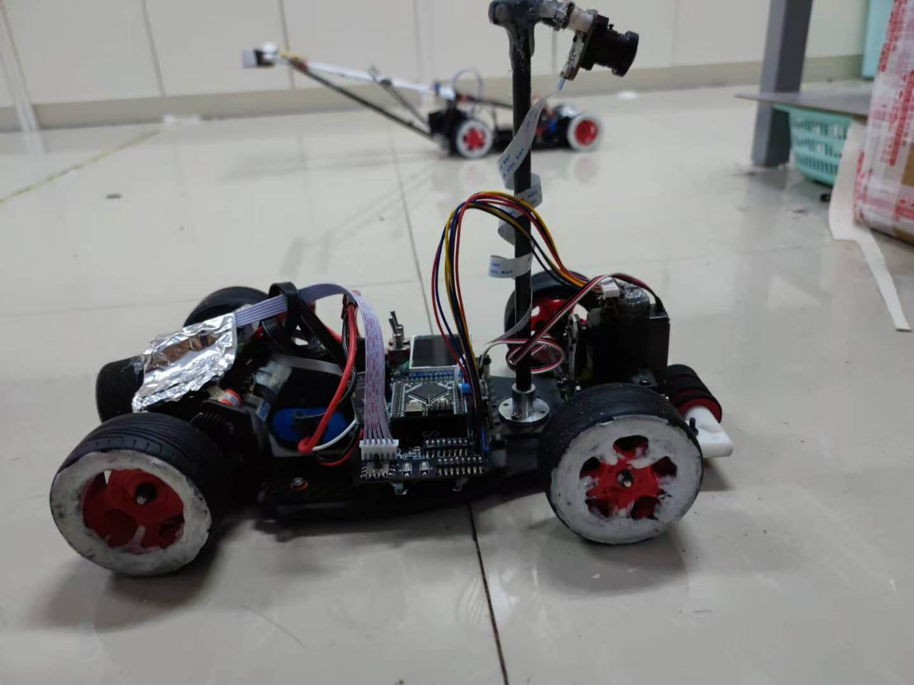
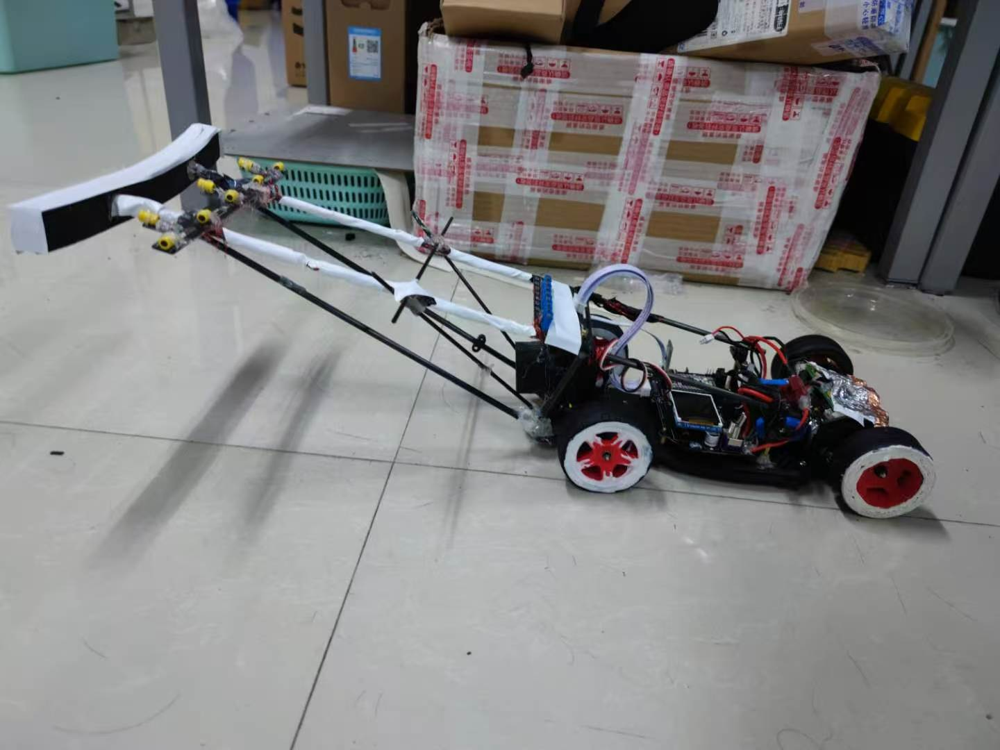
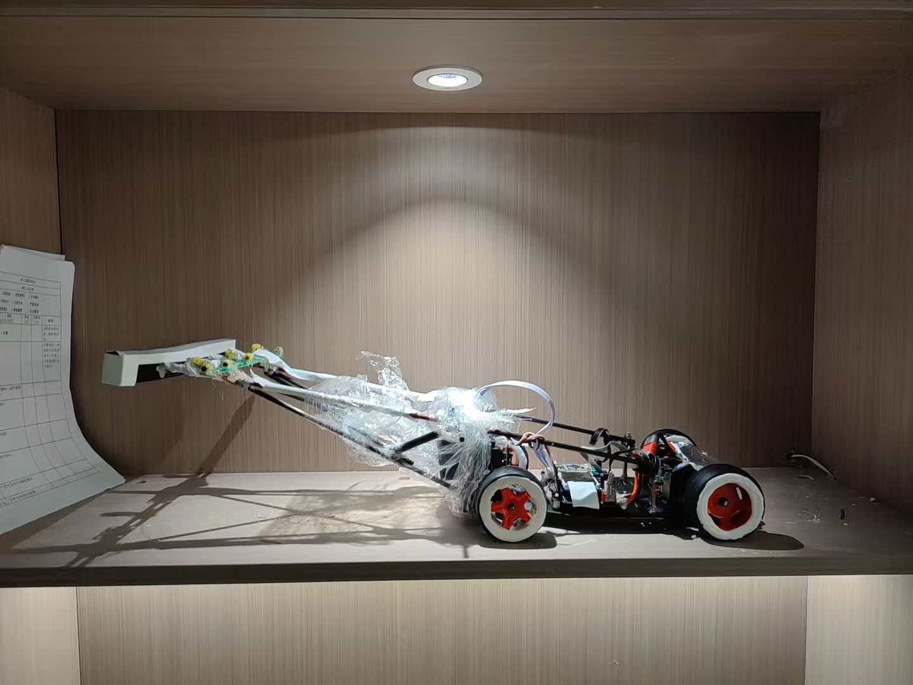
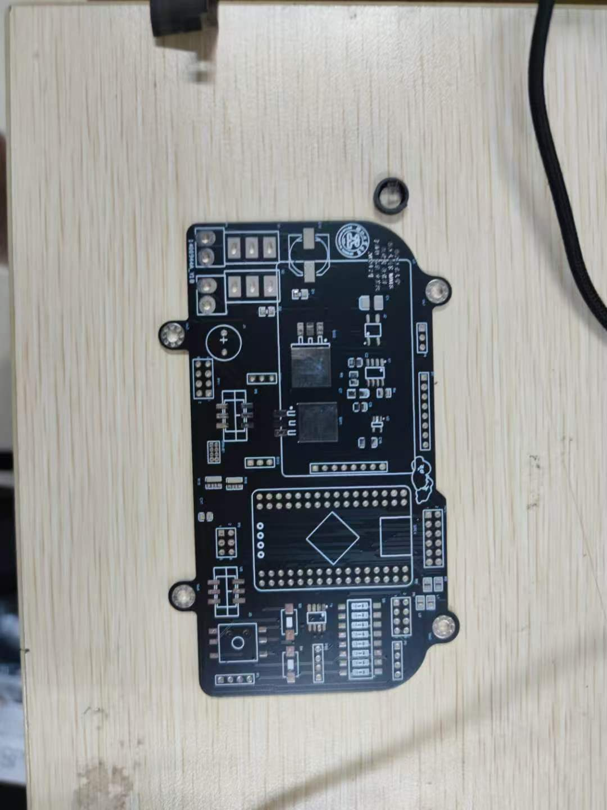

# 智能车多车编队

三车智能编队工程作品：CH32 视觉头车、STC 电磁中间车和 STC 电磁尾车。项目曾实现约 3 m/s 的三车运行速度和 50–70 cm 的跟车距离，并获得浙江省三等奖。

本人主要负责四类 PCB 的原理图与版图设计、车间通信、电磁循迹和整车联调。

## 实车与硬件

<p align="center">
  
  
  
</p>

<p align="center">
  
</p>

[查看三车编队演示视频](media/platooning-demo.mp4)

## 系统组成

```text
视觉头车（CH32） ── 无线状态/速度 ──> 电磁中间车（STC）
                                          │
                                          └── 无线状态/速度 ──> 电磁尾车（STC）
```

- 头车：MT9V034 视觉循迹、IMU、编码器和无线通信
- 中间车/尾车：八路电磁循迹、编码器、ToF/超声波测距和无线通信
- 执行部分：舵机转向、双路电机 H 桥驱动和轮速控制

## 板卡与工程文件

每个目录均包含：

- `*.pdf`：快速查看版原理图或工程输出
- `*.SchDoc`：Altium Designer 原理图源文件
- `*.PcbDoc`：Altium Designer PCB 源文件
- `README.md`：板卡接口和设计说明

| 板卡 | 主要用途 | 文件目录 |
|---|---|---|
| CH32 视觉头车主板 | 摄像头、IMU、编码器、测距、通信和执行器接口 | [hardware/ch32-mainboard](hardware/ch32-mainboard/) |
| STC 电磁中/尾车主板 | ADC、电磁传感器、编码器、测距、通信和执行器接口 | [hardware/stc-mainboard](hardware/stc-mainboard/) |
| 双电机驱动板 | 两路直流电机 H 桥驱动 | [hardware/motor-driver](hardware/motor-driver/) |
| 八通道电磁模拟前端 | 电磁信号放大、检波、包络和 ADC 输出 | [hardware/electromagnetic-afe](hardware/electromagnetic-afe/) |

## 预览与打开

只想查看原理图时，直接打开对应目录中的 PDF。需要编辑或检查工程时，使用 Altium Designer 打开 `SchDoc` 和 `PcbDoc` 文件。

源文件用于工程展示和技术交流；重新投板前请自行完成 DRC、网络连通性、封装、丝印、供电和安全间距检查。

## 公开说明

公开文件和图片经过隐私处理。文件权属、使用边界及未公开材料说明见 [NOTICE.md](NOTICE.md)。
